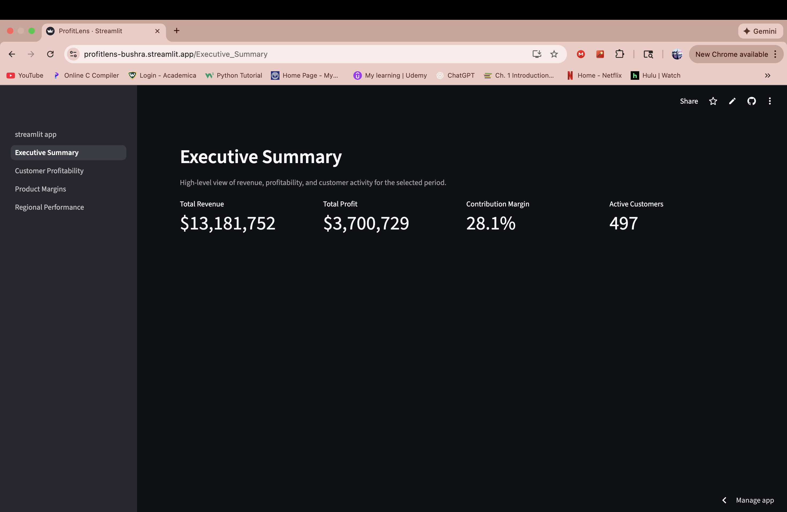

# ProfitLens

An end to end analytics and profitability intelligence system built with Python, SQL, PostgreSQL, and Streamlit that simulates how organizations model, transform, and analyze transactional business data for profitability reporting.

## Overview
This project simulates real world analytics engineering and business intelligence workflows using synthetic transactional data. ProfitLens is designed to resemble an internal decision support system used by analytics and finance teams to understand profitability across customers, products, and regions.

The application provides executive level KPIs and detailed profitability views backed by centralized and reproducible business logic.

## Live Demo
https://profitlens-bushra.streamlit.app/

## Business Problem
Organizations require reliable and transparent profitability reporting to support pricing, cost control, and strategic decision making. This requires:

- Consistent business logic across reports  
- Clean and well structured data models  
- Reproducible transformations  
- Clear executive facing insights  

ProfitLens addresses how raw transactional data can be transformed into trustworthy profitability insights used for business decisions.

## Solution Approach
The system follows a standard industry analytics workflow:

1. Generate realistic synthetic transactional data  
2. Load source aligned data into a raw database schema  
3. Apply centralized SQL based business logic in analytics tables and views  
4. Validate data quality through automated checks  
5. Present insights through a multi page executive dashboard  

All transformations and calculations are documented and reproducible.

## Key Metrics
- Revenue and cost by order  
- Gross profit and margin  
- Customer level profitability  
- Product level profitability  
- Regional performance summaries  

## Technologies Used
- Python  
- SQL  
- PostgreSQL  
- Pandas  
- Streamlit  
- Docker  

## Data and Logic
All datasets are generated programmatically using Python and stored as CSV files. Data is ingested into PostgreSQL under a raw schema and transformed into analytics tables and views using SQL.

Profitability logic includes revenue, cost, discount, and shipping calculations. All business rules are centralized to ensure consistency across dashboards and reports.


## Screenshot


## How to Run Locally
1. Start PostgreSQL using Docker  
2. Create schemas, tables, views, and indexes  
3. Run the data pipeline  
4. Launch the Streamlit dashboard  

```bash
docker compose up -d

docker exec -i profitlens_postgres psql -U profitlens_user -d profitlens < sql/00_schemas.sql
docker exec -i profitlens_postgres psql -U profitlens_user -d profitlens < sql/01_raw_tables.sql
docker exec -i profitlens_postgres psql -U profitlens_user -d profitlens < sql/02_analytics_tables.sql
docker exec -i profitlens_postgres psql -U profitlens_user -d profitlens < sql/03_views.sql
docker exec -i profitlens_postgres psql -U profitlens_user -d profitlens < sql/04_indexes.sql

python pipeline/generate_data.py
python pipeline/load_raw.py
python pipeline/quality_checks.py
python pipeline/build_analytics.py

streamlit run app/streamlit_app.py
```
## Future Improvements
-Support for incremental data loads
-Additional profitability breakdowns by channel
-Role based dashboard access
-Automated scheduling of pipeline execution
